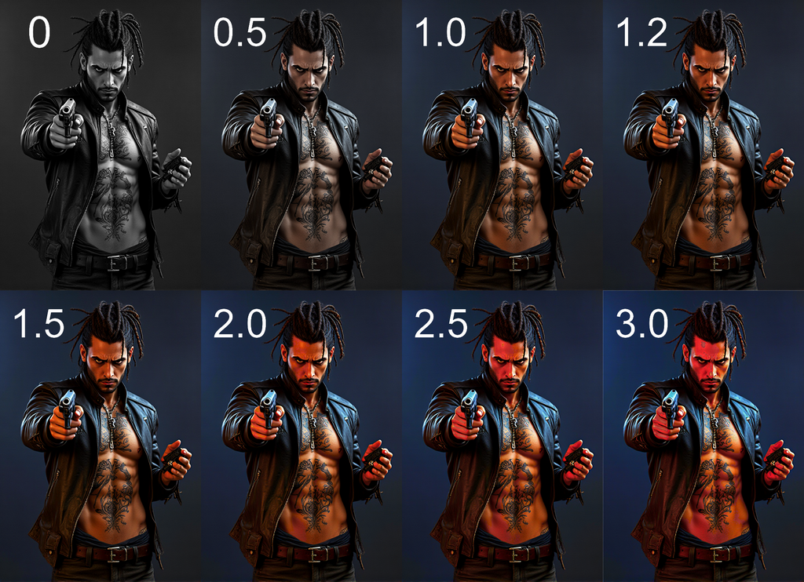

# 🦊 ComfyUI_RaykoStudio  
**(EN)**  Set of custom nodes for ComfyUI providing additional image processing capabilities  
**(RU)**  Набор пользовательских узлов для ComfyUI, предоставляющих дополнительные возможности обработки изображений  
---  

### 🛠 Installation (Установка)  
**(EN)**  
Set of nodes can be installed in several ways:  
- Clone repository to `ComfyUI/custom_nodes/` folder:  
```
git clone https://github.com/Raykosan/ComfyUI_RaykoStudio.git  
```
- Copy ComfyUI_RaykoStudio folder to: ComfyUI/custom_nodes/  
- You can install this node using the ComfyUI_Manager  

**(RU)**  
Набор нод можно установить несколькими способами:  
- Клонировать репозиторий в папку `ComfyUI/custom_nodes/` командой:  
```
git clone https://github.com/Raykosan/ComfyUI_RaykoStudio.git  
```
- Вы можете вручную скопировать папку ComfyUI_RaykoStudio в папку: ComfyUI/custom_nodes/  
- Вы можете установить этот узел с помощью ComfyUI_Manager  

## 🦊 RS Safe Saturation node  
**Professional image saturation control with artifact and highlight protection.**  
**Профессиональный контроль насыщенности с защитой от артефактов и бликов.**    

  

---

### 🔥 Features  (Особенности)  
**(EN)**  
- **Smooth adjustment** with 0.05 steps  
- **Smart boosting** without overexposure  
- **Artifact protection** even at extreme values  
- **Batch processing** optimized  
- **Supports**: Windows/Linux · Python 3.11+ · PyTorch 2.0+  

**(RU)**  
- **Плавная регулировка** с шагом 0.05  
- **Интеллектуальное усиление** без передержки  
- **Защита от артефактов** даже при экстремальных значениях 
- **Пакетная обработка** оптимизированная  
- **Поддерживается**: Windows/Linux · Python 3.11+ · PyTorch 2.0+    

### 🪛 Usage (Использование)  
  
| Range      | Processing Type               | Use Case                    |
|------------|-------------------------------|-----------------------------|
| 0.0-0.9    | Toning/desaturation           | Gradual color removal       |
| 1.0-1.3    | Natural enhancement           | Recommended range           |
| 1.3-2.0    | Vibrant artistic effects      | Stylization                 |
| 2.0-3.0    | Maximum saturation            | Cinematic effects           |

### ⚙️ Technical Details (Технические детали)  

**(EN)**  
Algorithm workflow:  
Luminance space conversion  

Non-linear adjustment:  
Values <1.0: Linear interpolation  
Values >1.0: Adaptive S-curve  

Auto highlight recovery  

**(RU)**  
Рабочий процесс алгоритма:  
Преобразование пространства яркости  

Нелинейная настройка:  
Значения <1,0: Линейная интерполяция  
Значения >1,0: Адаптивная S-образная кривая  

Автоматическое восстановление подсветки

---
	
## 🦊 RS Save Image Pair node  


---

### 🔥 Features  (Особенности)  
**(EN)**  
The node is used to save the source and destination images in a single image while preserving the workflow within the image. It is convenient for visual understanding of the workflow contained in the image.  

**(RU)**  
Нода используется для сохранения исходного и конечного изображения в одном изображении с сохранением рабочего процесса внутри изображения. Удобно для визуального понимания содержащегося в изображении воркфлоу.   

### 🪛 Usage (Использование)  
**(EN)**  
It is better to choose horizontal saving for portraits, and vertical saving for landscapes. The color is made to fill the empty space that is formed with different sizes of images.  

**(RU)**
Для портретов лучше выбирать горизонтальное сохранение, для лэндскейпов - вертикальное. Цвет сделан для заполнения пустующего места, которое образуется при разных размерах картинок.  

---

## 🦊 RS Image-Text   


---

### 🔥 Features  (Особенности)  
**(EN)**  
The node writes any hidden text to any png and jpeg file (jpeg is converted to png). And outputs text from images recorded in this way. You can use it instead of a Load Image (without a mask) and transfer the recorded text to the promt node. It is useful if there is an image and a shortcut to it, but the image does not contain a workflow (often found on the site civitai.com).  

**(RU)**  
Нода записывает любой текст в любой файл формата png и jpeg (jpeg преобразуется в png) в скрытом виде и выводит из изображений текст, записанный таким способом. Вы можете использовать ноду вместо ноды Load Image (без маски) и передавать прочитанный текст в ноду prompt. Это полезно, если есть изображение и промпт к нему, но само изображение не содержит рабочего процесса (часто встречается на сайте civitai.com).  

### 🪛 Usage (Использование)  
**(EN)**  
Two modes:  
Write - writes text to the uploaded image and saves it to the output folder with the prefix you specified.  
Read - reads the text you wrote earlier in the uploaded image, sends the text and images further according to the scheme.  
Link to the video: https://youtu.be/1s26hUcVXX4  

**(RU)**  
Два режима:  
Запись (write) - записывает указанный вами текст в загруженное изображение в скрытом виде и сохраняет его в папку output с указанным вами префиксом.  
Чтение (read) - читает текст записанный вами ранее из загруженного изображения, и отправляет текст и изображение далее по схеме.  
Ссылка на видео: https://youtu.be/1s26hUcVXX4  

---

## 🤝 Bug Reporting (Сообщение об ошибке)  

If you encounter an issue or find a bug:  

Check Issues section on GitHub, maybe problem is already known.  
If new problem, create new Issue describing:  

- ComfyUI and Python versions  
- Problem description and reproduction steps  
- Screenshots or error logs (if available)  

## 📜 License (Лицензия)  

MIT License. Use node at your own risk without any warranties.  

## ❤️ Acknowledgments (Благодарности)  

Thanks to ComfyUI community for inspiration and support! If you like this node, don't forget to star on GitHub!
