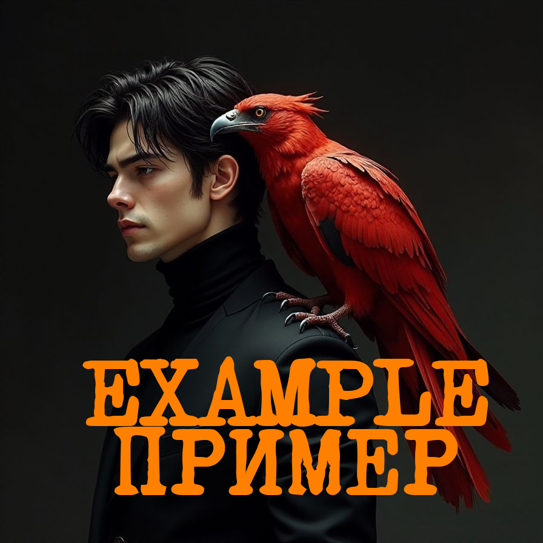

# 🦊 ComfyUI_RaykoStudio  
ComfyUI_RaykoStudio — a set of custom nodes for ComfyUI providing additional image processing capabilities  

  

# 🦊 RS_RusTextOverlay Node  

## 🔥 Description  

`RS_RusTextOverlay` allows overlaying text on an image within an area defined by a mask. The node supports text rotation according to the mask's tilt angle, automatic font size adjustment, custom fonts, line breaks, and text transparency settings.  

### Features  

- Overlaying text on an image within a mask-defined area  
- Automatic text rotation according to the mask's tilt angle (optional)  
- Support for custom fonts (`.ttf` or `.otf`) loaded from the `fonts` folder  
- Automatic font size adjustment to fit text within the mask area  
- Text color and transparency settings (0 to 100%)  
- Text alignment settings (vertical: top/center/bottom, horizontal: left/center/right)  
- Padding settings around text
- Line spacing (0.5 to 3.0)  

### Inputs  

- `image`: Image (RGB tensor)  
- `mask`: Mask (L tensor) defining the text area  

### Outputs  

- `IMAGE`: Image with overlaid text (RGB tensor)  

## ⚙️ Parameters  

- `text`: Text to overlay (supports line breaks)  
- `font_name`: Select font from available in `fonts` folder (or use `default`)  
- `text_color`: Text color (HEX format, e.g. `#FFFFFF`)  
- `text_opacity`: Text transparency (0-100%, where 0 - fully transparent, 100 - fully opaque)  
- `min_font_size`: Minimum font size (if text doesn't fit, default font is used)  
- `padding`: Padding around text within mask  
- `vertical_align`: Vertical text alignment (top/center/bottom)  
- `horizontal_align`: Horizontal text alignment (left/center/right)  
- `rotate_with_mask`: Enable/disable text rotation according to mask's tilt angle
- `line_spacing`: Adjusts the line spacing from 0.5 to 3.0

## 🛠 Installation  

- Clone repository to `ComfyUI/custom_nodes/` folder:
```
git clone https://github.com/Raykosan/ComfyUI_RaykoStudio.git
```
Restart ComfyUI  

OR  

Copy RaykoStudio_Nodes folder to: ComfyUI/custom_nodes/  
Restart ComfyUI  

- Ensure fonts folder contains fonts (.ttf or .otf). You can add your fonts to this folder. If folder is empty or missing, default font will be used.  

- Install required dependencies from requirements.txt:
```
pip install -r requirements.txt
```
Restart ComfyUI for node to become available.  

## ⛓️ Dependencies  

Required libraries (specified in requirements.txt):  
```
torch>=1.7.0  
numpy>=1.19.0  
Pillow>=8.0.0  
opencv-python>=4.5.0  
```
## 🎛 Usage  

After installation find node in ComfyUI under name 🦊 RS_RusTextOverlay (category: 🦊 RaykoStudio/Image).  
Connect inputs (image and mask) and adjust parameters.  
Example workflow can be found in examples folder:  
example workflow.json: example ComfyUI workflow  
example.png: Result screenshot  

## 🤝 Bug Reporting  

If you encounter an issue or find a bug:  

Check Issues section on GitHub, maybe problem is already known.  
If new problem, create new Issue describing:  

- ComfyUI and Python versions  
- Problem description and reproduction steps  
- Screenshots or error logs (if available)  

## 📜 License  

MIT License. Use node at your own risk without any warranties.  

## ❤️ Acknowledgments  

Thanks to ComfyUI community for inspiration and support! If you like this node, don't forget to star on GitHub!
